# React.js & Next.js Learning Journey

This repository contains a collection of projects built while learning React.js, Next.js, and modern frontend development technologies.
Each project focuses on improving skills in UI development, state management, backend integration, and responsive design.

## Projects

## Productivity Utility Hub

### Description
Productivity Utility Hub is a small React application built to practice the **useState hook**.  
It includes simple interactive utilities that demonstrate how state updates dynamically in React.

### Features
- State management using **React useState**
- Interactive UI components
- Real-time updates based on user input

### Tech Stack
- React.js
- typeScript
- CSS

### Preview

  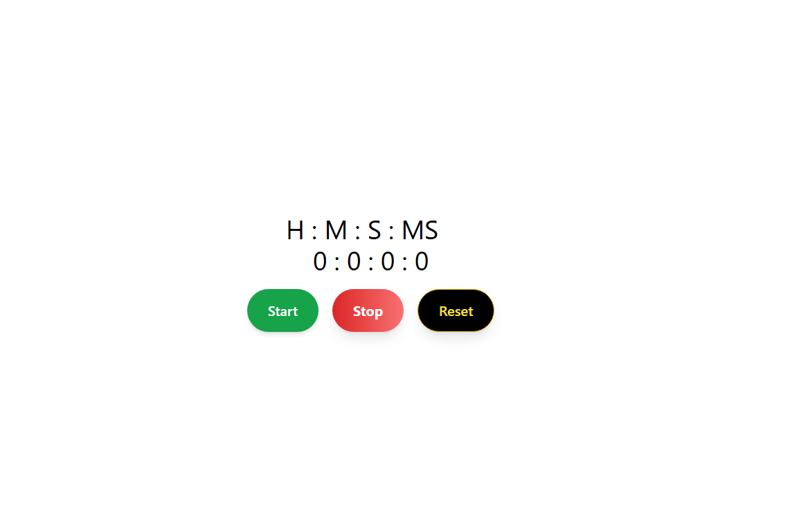
  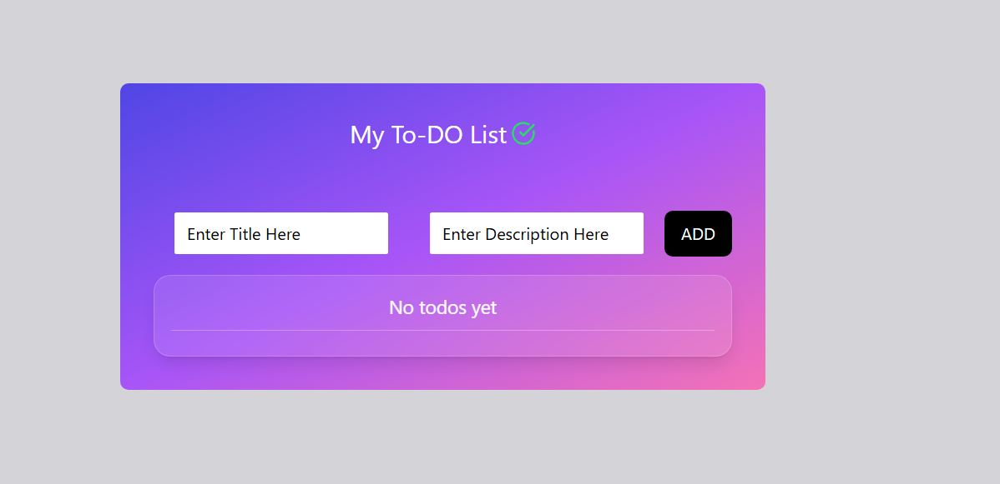

---

### 🚀 Next Project

---

## E-commerce Weather Joke State Logic

### Description
This React project is built to practice the **useEffect hook** and make **HTTP requests to APIs**.  
It demonstrates how to fetch external data and update the UI dynamically using React side effects.

### Features
- Fetch data from APIs using **useEffect**
- Dynamic UI updates based on API responses
- Practice handling asynchronous requests in React

### Tech Stack
- React.js
- typeScript
- CSS
- REST APIs

### Preview

  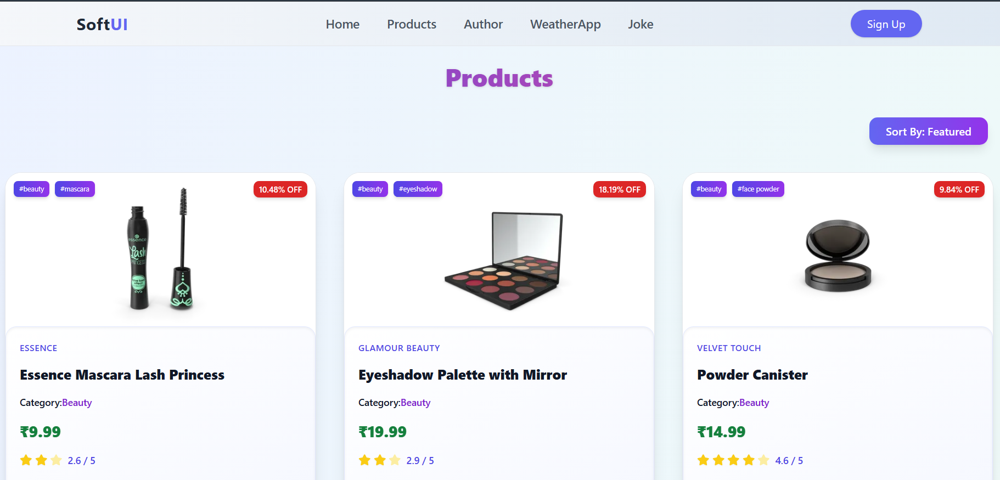
  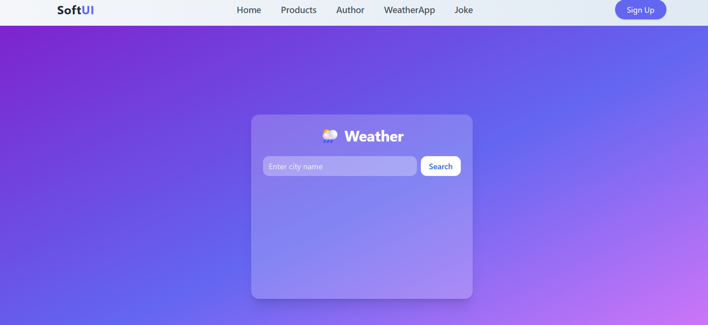
  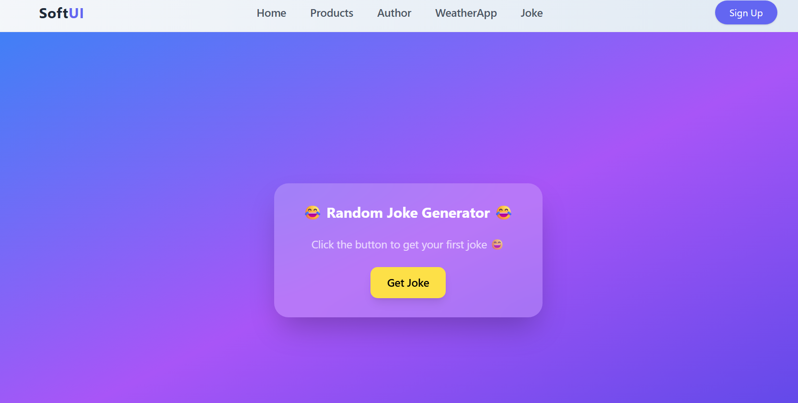

---

### 🚀 Next Project

---
## React Hooks Performance Demo

### Description
This project demonstrates the use of **useMemo, useCallback, and useRef** hooks in React to optimize component performance and manage component references.

These hooks help improve application efficiency by preventing unnecessary re-renders and caching expensive computations. :contentReference[oaicite:0]{index=0}

### Features
- Performance optimization using **useMemo**
- Memoized functions using **useCallback**
- DOM and mutable value references with **useRef**

### Tech Stack
- React.js
- typeScript
- CSS

### Preview

  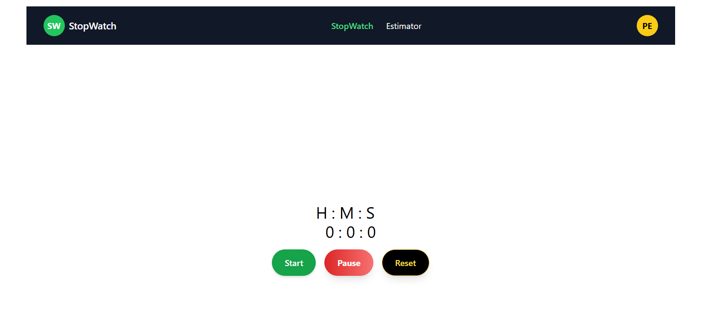

---

### 🚀 Next Project

---
## Appwrite Integration Demo

### Description
This project demonstrates how to integrate **Appwrite** with a React application for backend services such as authentication and database operations.

Appwrite is an open-source **backend-as-a-service (BaaS)** platform that provides APIs for authentication, databases, storage, and other backend features. :contentReference[oaicite:1]{index=1}

### Features
- Backend integration using **Appwrite**
- Authentication and database interaction
- Frontend-backend communication in React

### Tech Stack
- React.js
- Appwrite
- typeScript
- CSS

### Preview

  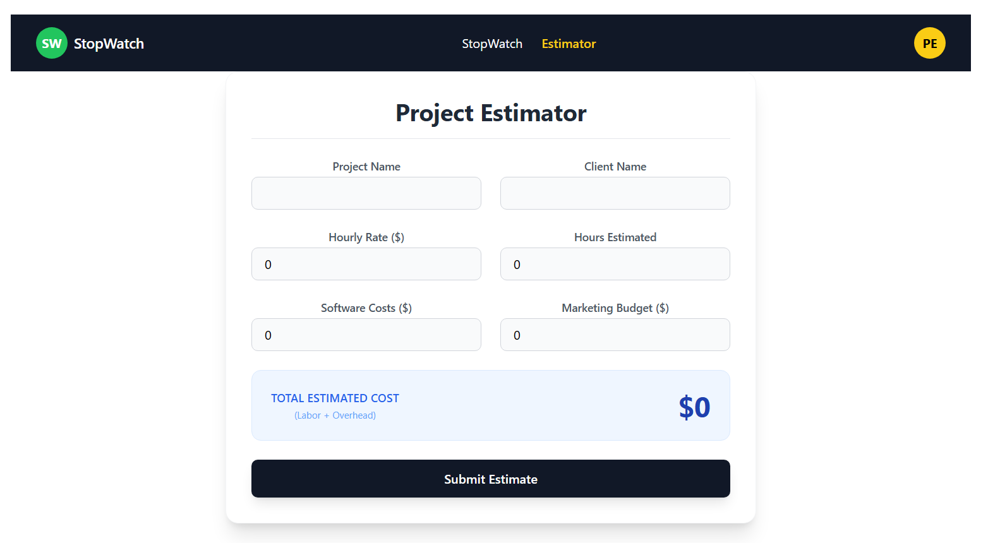

---

### 🚀 Next Project

---
## Global State Management with useReducer & useContext

### Description
This React project demonstrates how to manage **global application state** using **useReducer and useContext**.  
It shows how multiple components can share and update state without prop drilling.

### Features
- Global state management using **useReducer**
- Shared state using **React Context API**
- Clean state updates through reducer actions

### Tech Stack
- React.js
- typeScript
- Context API
- CSS

### Preview

  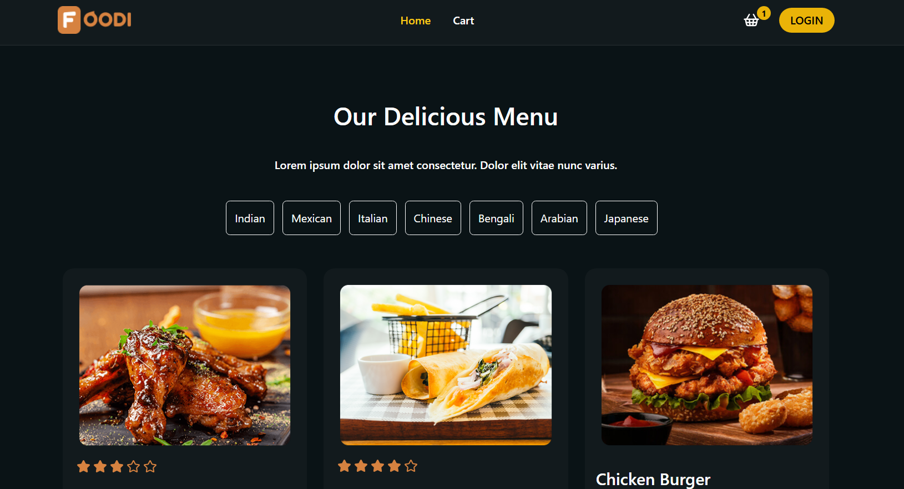

---

### 🚀 Next Project

---
## Persistent State with LocalStorage

### Description
This React project demonstrates how to persist application state using **localStorage**.  
It stores data in the browser so the state remains available even after refreshing the page.

### Features
- Store and retrieve data using **localStorage**
- Persist application state across page refresh
- Simple client-side data persistence example

### Tech Stack
- React.js
- TypeScript
- LocalStorage API
- CSS

### Preview

  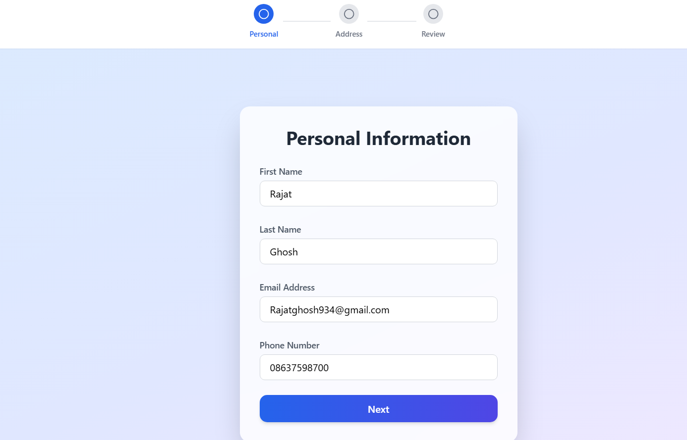

---

### 🚀 Next Project

---
## Redux State Management

### Description
This project demonstrates how to manage **global application state using Redux** in a React application.  
It shows how components can access and update shared state through actions and reducers.

### Features
- Global state management using **Redux**
- Dispatching actions to update state
- Sharing data between multiple components

### Tech Stack
- React.js
- Redux
- TypeScript
- CSS

### Preview

  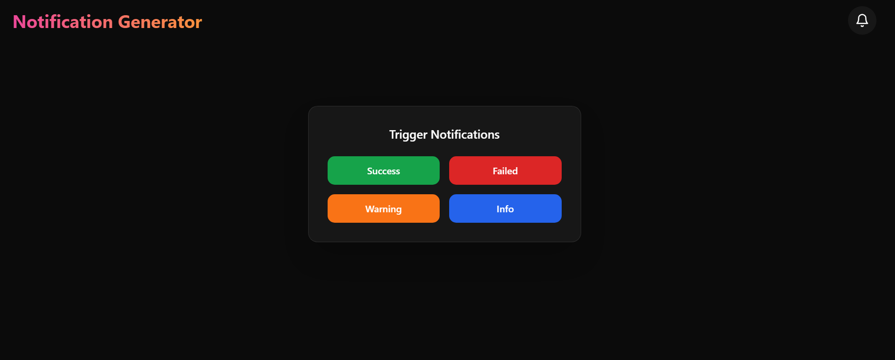

---

### 🚀 Next Project

---
## Redux Toolkit Demo

### Description
This project demonstrates modern state management using **Redux Toolkit**, which simplifies Redux development by reducing boilerplate and providing built-in utilities for store setup and reducers. :contentReference[oaicite:1]{index=1}

### Features
- Global state management using **Redux Toolkit**
- Simplified reducers using **createSlice**
- Easy store configuration using **configureStore**

### Tech Stack
- React.js
- Redux Toolkit
- TypeScript
- CSS

### Preview

  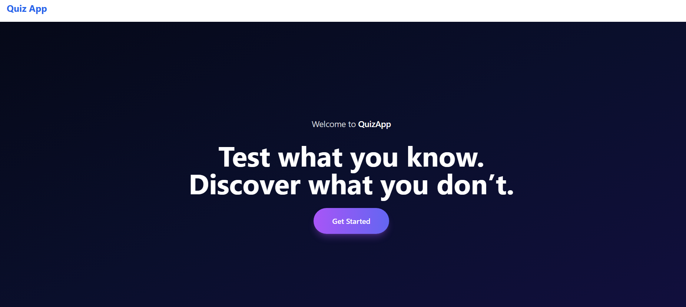

---

### 🚀 Next Project

---
## Next.js Supabase Realtime App

### Description
This project demonstrates building a **real-time application using Next.js, Zustand, and Supabase**.  
It shows how frontend state management can work together with a backend service to update data instantly when changes occur.

### Features
- Real-time data updates using **Supabase**
- Global state management with **Zustand**
- Backend integration with **Supabase database**

### Tech Stack
- Next.js
- Zustand
- Supabase
- JavaScript

### Preview

  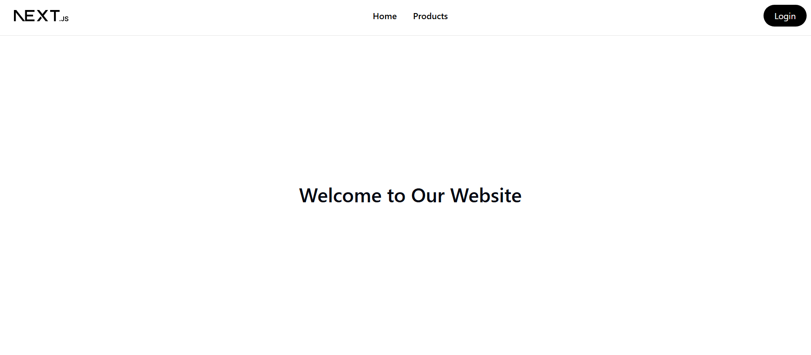

